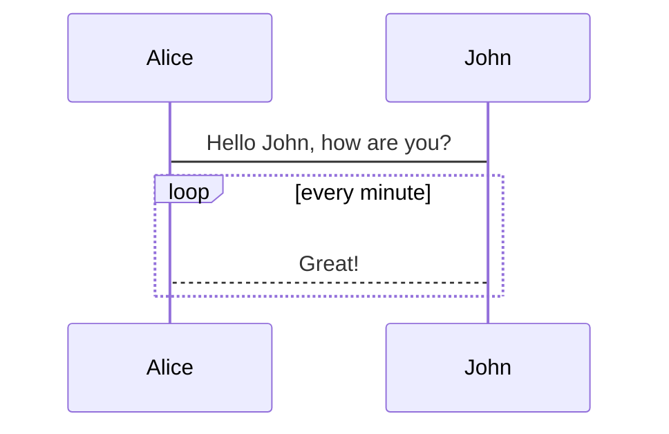
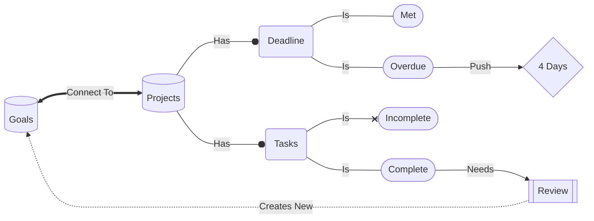
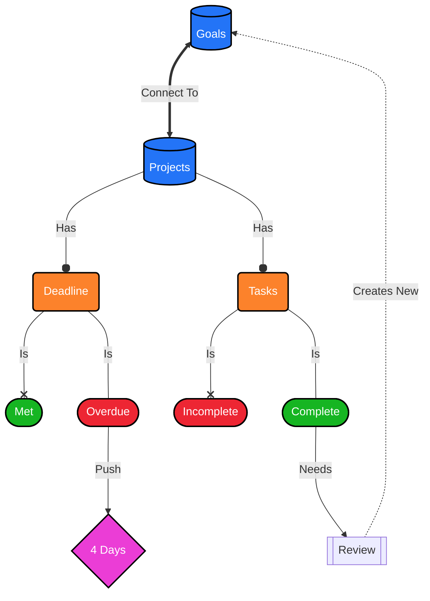

## {{ $frontmatter.title }}

```mermaid
sequenceDiagram
Alice->John: Hello John, how are you?
loop every minute
    John-->Alice: Great!
end
```

```mermaid

flowchart LR

%% GOALS DATABASE %%

%% Goals & Projects %%
G[(Goals)] <===> |Connect To| P[(Projects)]

%% PROJECTS DATABASE %%

%% Deadline %%
P ---o |Has| PD(Deadline)
PD ---- |Is| MT([Met]) & OV([Overdue])
OV ---> |Push| OVF{4 Days}

%% Tasks %%
P ---o |Has| PT(Tasks)
PT ---x |Is| IC([Incomplete])
PT ---- |Is| C([Complete])
C ---> |Needs| R[[Review]]

%% Review & Goals %%
R -..-> |Creates New| G

```

```mermaid
flowchart TD

%% Colors %%
classDef blue fill:#2374f7,stroke:#000,stroke-width:2px,color:#fff
classDef pink fill:#eb3dd6,stroke:#000,stroke-width:2px,color:#fff
classDef orange fill:#fc822b,stroke:#000,stroke-width:2px,color:#fff
classDef red fill:#ed2633,stroke:#000,stroke-width:2px,color:#fff
classDef green fill:#16b522,stroke:#000,stroke-width:2px,color:#fff


%% GOALS DATABASE %%

%% Goals & Projects %%
G[(Goals)]:::blue <===> |Connect To| P[(Projects)]:::blue


%% PROJECTS DATABASE %%

%% Deadline %%
P ---o |Has| PD(Deadline):::orange
PD ---x |Is| MT([Met]):::green
PD ---- |Is| OV([Overdue]):::red
OV ---> |Push| OVF{4 Days}:::pink

%% Tasks %%
P ---o |Has| PT(Tasks):::orange
PT ---x |Is| IC([Incomplete]):::red
PT ---- |Is| C([Complete]):::green
C ---> |Needs| R[[Review]]

%% Review & Goals %%
R -..-> |Creates New| G

```
